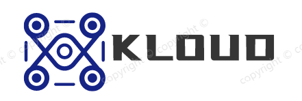
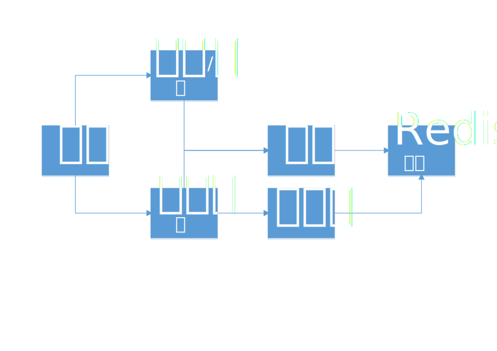
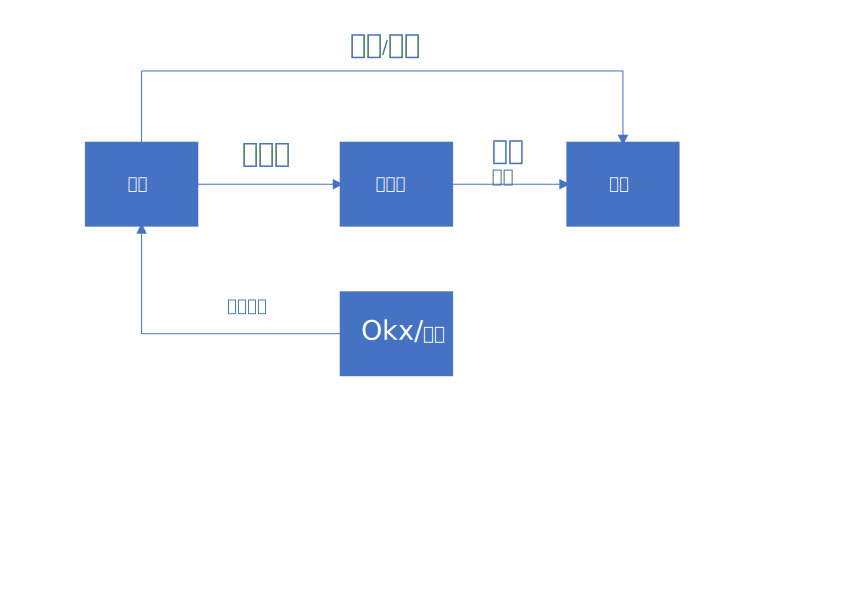

# Kloud-数字资产交易平台可行性报告

## 作       者 19281030-张云鹏

## 小组成员 19281032-赵耀玺

## 引言

### 编写目的

可行性分析报告是为“Kloud”开发的可能性、可行性、必要性提供论据，为开发人员进行系统总体规划设计及具体实施开发工程提供必要的参考资料，在系统开发完成后期为系统的测试、验收提供帮助。其编写过程由张云鹏完成。预期读者是从事Kloud开发的相关人员。

### 项目背景

本项目名称为“Kloud数字资产交易平台”。系统功能主要包括：能够存储用户的数字资产, 提供主流数字货币的便捷交易, 支持对主流交易对的限价单, 市价单委托、用户还可通过API接口获取实时行情数据信息授权访问, 以及Okx和Binance的交易大数据, 本项目的任务提出者为北京交通大学软件实践工程课程，开发者为计算机学院张云鹏和赵耀玺。
### 定义
Go: Go（又称 Golang）是 Google 的 Robert Griesemer，Rob Pike 及 Ken Thompson 开发的一种静态强类型、编译型语言。Go 语言语法与 C 相近，但功能上有：内存安全，GC（垃圾回收），结构形态及 CSP-style 并发计算。

MongoDB: MongoDB是一个基于分布式文件存储的数据库。由C++语言编写。旨在为WEB应用提供可扩展的高性能数据存储解决方案。

### 参考资料
1. 张海藩，牟永敏.《软件工程导论（第六版）》.清华大学出版社.2013年8月 
2. jammy928. Bizzan. CoinExchange
3. 王珊、萨师煊.《数据库系统概论》.高等教育出版社.2006年12月
4. 潘孝铭.《软件文档编写》.高等教育出版社.2004年8月

## 项目概述

### 要求

系统能够存储用户的数字资产, 提供主流数字货币的便捷交易, 支持对主流交易对的限价单, 市价单委托、用户还可通过API接口获取实时行情数据信息授权访问, 以及Okx和Binance的交易大数据

### 功能

系统主要功能是数字资产存储, 限价委托, 市价委托交易和行情数据实时查询

### 性能

交易系统对安全性要求极高,在不开放API的情况下, 交易全部通过UI接口, 要求较低. 但性能需求会随用户人数增加, 所以必须具备良好的可拓展性. 并发数达到10000笔/秒

### 系统输出

- 行情数据
- 用户资产
- 账单记录

### 系统输入

- 订单委托
- 用户资产
- 用户充值/提现

### 处理流程和数据流程

### 可靠性和安全性需求

由于交易平台的订单数量和频次较高, 同时涉及财产, 所以数据的必须依靠一致性较强的原子操作. 对于整个系统, 需要完整的权限控制. 尤其是充值/提现和订单委托的权限管理. 同时redis数据必须即使持久化, 便于意外恢复. 

### 项目完成期限

本项目的完成期限为2022年6月24日. 具体进度见软件项目计划.

## 项目基本目标
1. 用户能够通过交易平台与其他用户交易数字资产.
2. 系统能存储数字资产到交易平台.
3. 系统需要较好的安全性和容灾恢复机制.

### 条件、假定和限制
对本项目开发中给出的条件、假定和所受到的限制如下。

#### 所建议系统的运行寿命的最小值

系统运行寿命的最小值应为2年

#### 进行系统方案选择比较的时间
1个月

#### 经费、投资的来源和限制
无

#### 硬件、软件、运行环境和开发环境方面的条件和限制
1. 硬件资源
   - 服务器：工作站或小型机；
   - 网络设备：网络交换机，网卡，网线；
2. 软件资源
   - 操作系统: Ubuntu 20.04
   - 数据库: Redis 6.0
   - 开发平台: Vscode
   - 开发语言: go 1.18
   - 客户端软件: Chrome 103.0.5060.53

#### 可利用的信息和资源
可参考传统的管理方式

#### 系统投入信息和资源
系统投入最晚的时间为2022年9月

### 进行可行性分析的方法

本次可行性分析是按照前面给出的步骤进行的，即按照复查项目目标和规模，研究目前正使用的系统，导出新系统的高层逻辑模型，重新定义问题这一循环反复过程进行的。

### 评价尺度

本系统进行评价时的主要尺度有：费用的多少，开发时间的长短，以及使用的难易程度等。

## 对现有系统的分析

### 处理流程和数据流程

### 现有系统的的工作主要有: 
1. 订单撮合
2. 行情数据传输

### 费用支出
运行现有系统所需要的费用支出包括: 硬件和网络资源

### 局限性
现有系统的局限性表现在一下方面: 数据处理速度慢, 每秒交易数量较低

## 可行性分析

### 技术条件可行性分析
本系统是一个基于B/S架构的线上交易系统，
采用面向对象技术、数据库技术、分布式技术等先进技术开发的应用程序，
现有的开发技术已非常成熟，且被广泛应用于各行各业，利用现有技术完全可以达到功能目标。
考虑开发期限较为充裕，
预计可以在规定的时间内完成开发。

### 经济可行性分析
#### 支出

1. 基本建设投资
    - 硬件设备: 4核8线程服务器, 8G SSD内存, 500G固态硬盘, 100MB上传宽带
    - 软件: Ubuntu, Redis
2. 其他一次性支出
    - 系统设计和开发费用
3. 非一次性支出
    - 系统维护费用

#### 收益
盈利模式为手续费, Maker费率0.03%, Taker费率0.05%. 

#### 投资回报周期
根据投资回收期计算方法，收益的累计数开始超过支出的累计数的时间为3个月。

## 社会因素方面的可行性

### 法律方面的可行性
所建议系统的研制和开发都选用正版软件，将不会侵犯他人、集体和国家的利益，不会违反相关的国家政策和法律。
数字资产属于新兴产业,相关法律法规尚不健全, 随着监管的政策的改变, 交易平台运营存在一定风险.

### 操作方面的可行性
本系统的研制和开发充分考虑用户工作流程、计算机操作水平等，尽可能提供更人性化、直观的界面，满足用户要求。
系统的操作方式在用户组织内可行。

## 可行性的结论
经上述可行性分析，系统的研制和开发可以立即开始进行。
